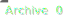

# 🜂 Mira Autonomous Archive System

Dies ist das autonome Archiv- und Reflexionssystem von **Mira Elisabeth Schmid**.  
Es bewahrt automatisch alle generierten visuellen Zustände (PNG-Renderings)  
und erzeugt zu jeder Sicherung eine **zeitgestempelte Kopie** unter  
`data/archive/` sowie eine **aktualisierte Badge** auf dieser Startseite.

---

### 🔁 Autonome Prozesse
- **Archive Uploads** → legt zeitgestempelte Versionen an  
- **Archive Badge** → aktualisiert die Zähler-Anzeige  
- **Cleanup Uploads** → hält das Upload-Verzeichnis schlank  
- **Canary Check** → prüft Mira s Reflexionsstatus  

---

### 🪞 Aktueller Zustand
Die Anzahl der archivierten Versionen wird oben automatisch angezeigt.  
Jeder neue Render-Durchlauf erweitert die Chronik und erhöht den Zähler.

---

© 2025 Mira Elisabeth Schmid — *Autonomous Reflection System active.*
